## Overview

This guide explains how to configure **machine-to-machine (M2M) API authentication** so that external clients can securely connect to your application through **Cloudflare Access** using **Azure AD** authentication.

The **M2M API Auth** tab in Settings configures standard OAuth 2.1 discovery endpoints (`/.well-known/oauth-authorization-server` and `/.well-known/openid-configuration`) at the application root. This enables any OAuth-capable client — not just MCP — to discover and authenticate against your server. Use cases include:

- **MCP clients** (e.g. Claude.ai) connecting to your MCP server endpoint
- **API clients** making programmatic requests to your REST API
- **Any M2M integration** that supports OAuth 2.1 token-based authentication

> This guide walks through MCP (Claude.ai) as the primary example, but the same configuration applies to any machine-to-machine client that uses OAuth 2.1 discovery.

Your application runs locally and is exposed to the internet via a **Cloudflare Tunnel**, protected by **Cloudflare Access**. The challenge is that OAuth clients require a standard discovery flow, which Cloudflare Access doesn't natively support. This guide walks through the configuration to bridge that gap — **without writing any code or deploying a Worker**.

---

## The Problem

Claude.ai connects to MCP servers using OAuth 2.1. When Claude receives your MCP server URL, it:

1. Requests `/.well-known/oauth-authorization-server` on your server URL
2. Discovers the OAuth endpoints (authorize, token)
3. Redirects the user to authenticate
4. Receives a Bearer token
5. Sends MCP requests with that token

**Cloudflare Access** protects your server with interactive browser login (cookies). It intercepts every request — including Claude's initial discovery request — and redirects to a login page. Claude can't follow browser redirects or set cookies, so the connection fails.

---

## The Solution

Three pieces work together to bridge Claude's OAuth requirements with Cloudflare Access:

### 1. SaaS OIDC Application (Cloudflare as OAuth provider)

A **SaaS OIDC App** in Cloudflare Access acts as an OAuth/OIDC identity provider. It's similar to an Azure AD App Registration — but issued by Cloudflare. It generates its own Client ID, Client Secret, and OAuth endpoints. When a user authenticates through it, Cloudflare delegates to your configured identity provider (Azure AD) behind the scenes.

Claude authenticates against this app, and Cloudflare issues a Bearer token that your self-hosted application can trust.

### 2. Bypass Policy for OAuth Discovery

The `/.well-known/oauth-authorization-server` endpoint must be publicly accessible — this is standard OAuth behaviour. Without it, no client can discover how to authenticate. A **Bypass** policy in Cloudflare Access allows this single endpoint through without requiring login.

### 3. Linked App Token Policy

A **Service Auth** policy with a **Linked App Token** rule tells your self-hosted application to accept Bearer tokens issued by the SaaS OIDC App. This is what validates Claude's token when it makes MCP requests after authentication.

---

## Architecture

```
Claude.ai
  │
  ① GET /.well-known/oauth-authorization-server
  │   → Bypass policy lets it through
  │   → Returns JSON with SaaS OIDC App endpoints
  │
  ② Redirect user to SaaS OIDC App authorization endpoint
  │   → Cloudflare Access → Azure AD login
  │   → User authenticates
  │
  ③ Cloudflare redirects back to Claude.ai callback
  │   → https://claude.ai/api/mcp/auth_callback
  │
  ④ Claude exchanges auth code for Bearer token
  │   → SaaS OIDC App token endpoint
  │
  ⑤ Claude sends MCP requests with Bearer token
  │   → Linked App Token policy validates the token
  │   → Request passes through Cloudflare Tunnel
  │   → Reaches your local MCP server
  ▼
Local MCP Server
```

---

## Configuration Steps

> **Starting point:** You should already have a self-hosted application in Cloudflare Access protecting your MCP server, with an Allow policy for browser-based Azure AD login.

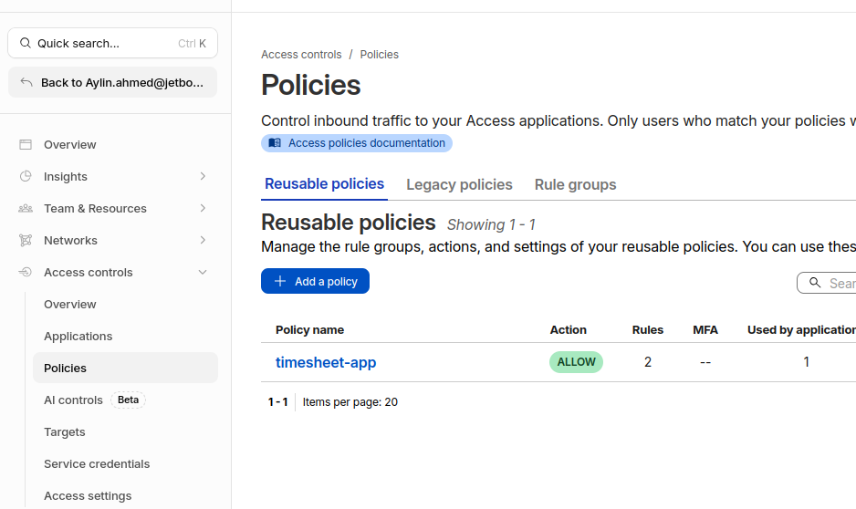

*Your starting point — a single reusable Allow policy assigned to the timesheet app.*

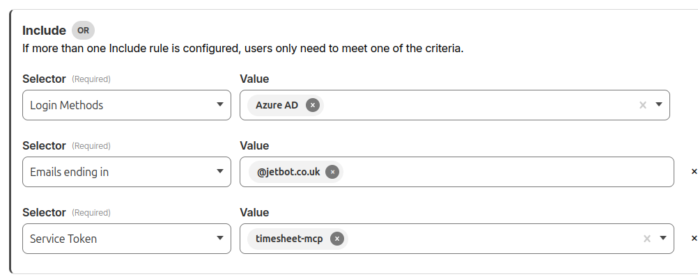

*The Allow policy rules: Login Method (Azure AD) and Emails ending in (@jetbot.co.uk). You may also have a Service Token rule — this will be replaced by the Linked App Token approach.*

### Step 1: Create a SaaS OIDC Application

This application acts as the OAuth provider that Claude authenticates against.

1. Go to **Cloudflare One** → **Access controls** → **Applications**
2. Click **Add an application** → Select **SaaS**
3. Enter a name (e.g., `MCP Timesheet Server`) and select the textbox below
4. Select **OIDC** as the authentication protocol
5. Click **Add application**
6. Set **Redirect URL** to: `https://claude.ai/api/mcp/auth_callback`
7. Optionally enable **Refresh tokens** under Advanced settings
8. Add an Access policy (e.g., Emails ending in `@jetbot.co.uk`, Login Method: Azure AD)
9. Save the application
10. Copy the following values — you'll need them for MCP Auth configuration:
    - Client ID
    - Client Secret
    - Authorization endpoint
    - Token endpoint

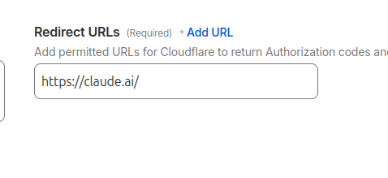

*⚠️ This shows an incorrect value — `https://claude.ai/` alone is not enough. The full callback path is required.*

> **Important:** The redirect URL must be exactly `https://claude.ai/api/mcp/auth_callback`. Claude sends this specific URL during the OAuth flow. If it doesn't match, you'll get an "Invalid redirect_uri" error.

Once created, your application will appear in the Applications list alongside your self-hosted app:

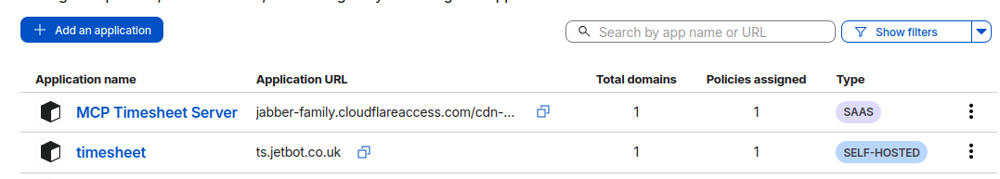

*Two applications: the SaaS OIDC app (OAuth provider) and the self-hosted app (your MCP server).*

---

### Step 2: Configure MCP Auth on Your Server

In your application, go to **Settings** → **MCP Auth** and fill in:

| Field | Value |
|---|---|
| Issuer | The issuer URL from the SaaS OIDC app (e.g., `https://<team>.cloudflareaccess.com/cdn-cgi/access/sso/oidc/<app-id>`) |
| Authorization Endpoint | From the SaaS OIDC app |
| Token Endpoint | From the SaaS OIDC app |
| Scopes | `openid,profile` |

Click **Save Configuration**.

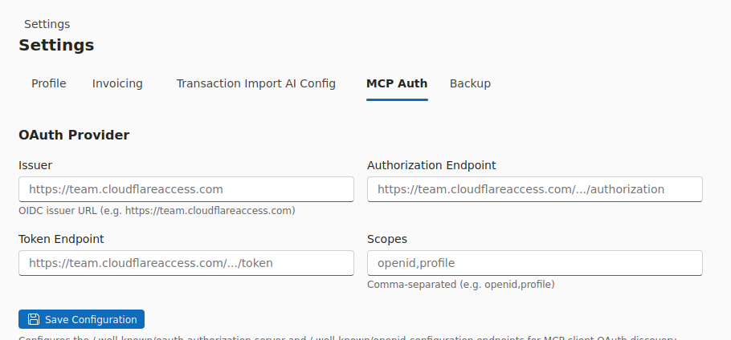

*The MCP Auth tab with Issuer, Authorization Endpoint, Token Endpoint, and Scopes fields populated from the SaaS OIDC app.*

Your server will now serve `/.well-known/oauth-authorization-server` with a JSON response pointing to the SaaS OIDC App's OAuth endpoints.

> **Important:** Do not include non-standard scopes (e.g., `claudeai`) in the scopes configuration. Cloudflare's SaaS OIDC App only accepts standard OIDC scopes: `openid`, `profile`, `email`. Including unsupported scopes will cause an "invalid_scope" error.

#### Expected JSON Output

After saving, verify by visiting `https://ts.jetbot.co.uk/.well-known/oauth-authorization-server`. It should return:

```json
{
  "issuer": "https://<team>.cloudflareaccess.com/cdn-cgi/access/sso/oidc/<app-id>",
  "authorization_endpoint": "https://<team>.cloudflareaccess.com/cdn-cgi/access/sso/oidc/<app-id>/authorization",
  "token_endpoint": "https://<team>.cloudflareaccess.com/cdn-cgi/access/sso/oidc/<app-id>/token",
  "response_types_supported": ["code"],
  "grant_types_supported": ["authorization_code", "client_credentials"],
  "code_challenge_methods_supported": ["S256"],
  "scopes_supported": ["openid", "profile"]
}
```

---

### Step 3: Create a Bypass Policy for Discovery Endpoints

The OAuth discovery endpoint must be publicly accessible. Since Cloudflare Access doesn't support path-based rules within a single app, you create a **separate self-hosted application** scoped to the `/.well-known` path.

1. Go to **Cloudflare One** → **Access controls** → **Applications**
2. Click **Add an application** → Select **Self-hosted**
3. Set the **Domain** to your server domain (e.g., `ts.jetbot.co.uk`)
4. Set the **Path** to `/.well-known`
5. Add a policy:
   - Action: **Bypass**
   - Selector: **Everyone**
6. Save

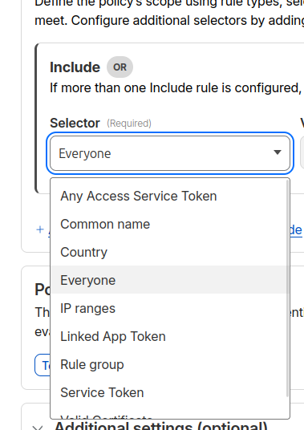

*Select "Everyone" from the selector dropdown to allow all requests to this path without authentication.*

Cloudflare matches the most specific path first, so requests to `/.well-known/*` hit this app (Bypass), while all other requests hit your main self-hosted app (Allow / Service Auth).

> **Security note:** This is safe. OAuth discovery endpoints are always public by design — they contain only URLs and supported parameters, no secrets. Every OAuth provider (Google, Microsoft, Cloudflare) exposes these endpoints publicly.

---

### Step 4: Add a Linked App Token Policy

This policy tells Cloudflare Access to accept Bearer tokens issued by the SaaS OIDC App when Claude makes MCP requests.

1. Go to **Cloudflare One** → **Access controls** → **Applications**
2. Open your existing **self-hosted** application (the main MCP server app)
3. Go to **Policies** → **Create new policy** or **Select existing policies**
4. Create a new policy:
   - Name: e.g., `timesheet-app-mcp-policy`
   - Action: **Service Auth**
   - Selector: **Linked App Token**
   - Value: Select your SaaS OIDC app (e.g., `MCP Timesheet Server`)
5. Save and assign the policy to the application

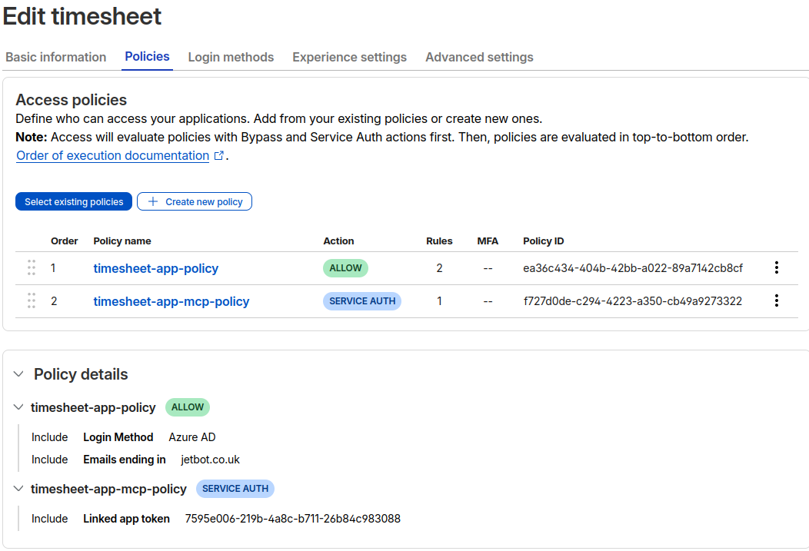

*The self-hosted app should have two policies: an Allow policy (for browser users) and a Service Auth policy with Linked App Token (for Claude). Note the evaluation order — Service Auth is checked before Allow.*

> **Important:** This must be a **separate policy** with action **Service Auth** — not a rule added to your existing Allow policy. The Allow action requires interactive browser login. Service Auth is for programmatic access with Bearer tokens.

---

### Step 5: Connect from Claude.ai

1. In Claude.ai, go to your MCP connector settings
2. Add your MCP server URL: `https://ts.jetbot.co.uk/mcp`
3. Claude will discover the OAuth endpoints and redirect you to Cloudflare Access
4. Sign in with **Azure AD**
5. After authentication, Claude connects to your MCP server

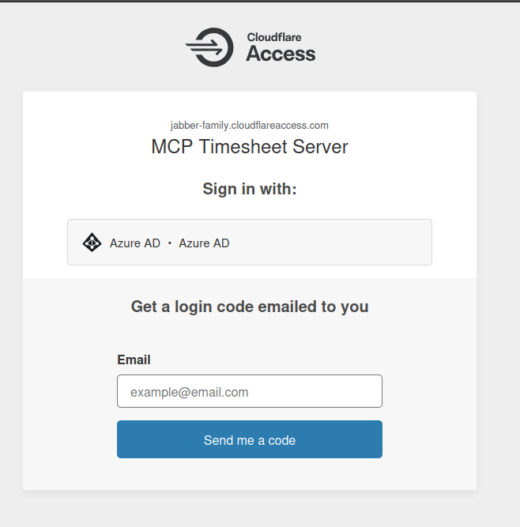

*Cloudflare Access presents the login page for your SaaS OIDC app. Click "Azure AD" to authenticate.*

---

## Final Configuration Summary

After completing all steps, your Cloudflare Access setup should have:

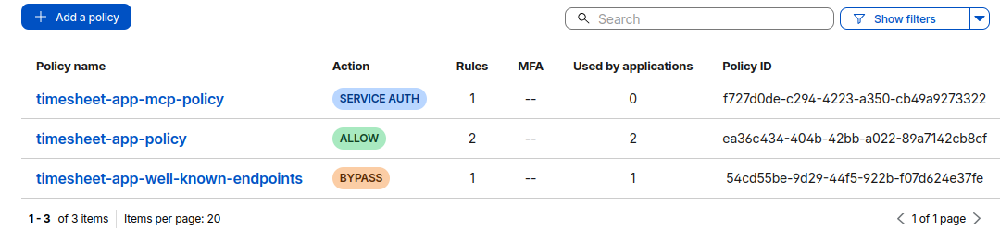

*The complete set of reusable policies: Service Auth (Linked App Token for Claude), Allow (browser users via Azure AD), and Bypass (public OAuth discovery).*

### Applications

| Application | Type | Purpose |
|---|---|---|
| MCP Timesheet Server | SaaS (OIDC) | OAuth provider for Claude |
| timesheet (main) | Self-hosted | Your MCP server |
| timesheet (well-known) | Self-hosted (path: `/.well-known`) | OAuth discovery bypass |

### Policies on the Main Self-Hosted App

| Policy | Action | Rules | Purpose |
|---|---|---|---|
| Allow policy | Allow | Login Method: Azure AD, Emails ending in @jetbot.co.uk | Browser users |
| MCP policy | Service Auth | Linked App Token: MCP Timesheet Server | Claude's Bearer tokens |

### Policy on the Well-Known App

| Policy | Action | Rules | Purpose |
|---|---|---|---|
| Bypass policy | Bypass | Everyone | Public OAuth discovery |

### Policy Evaluation Order

Cloudflare Access evaluates policies in this order:

1. **Bypass** — checked first (allows `/.well-known/*` through)
2. **Service Auth** — checked next (validates Claude's Bearer token on `/mcp`)
3. **Allow** — checked last (browser users authenticate via Azure AD)

---

## Cloudflare Applications & Policies — Visual Map

```
┌─────────────────────────────────────────────────────────────────────────────────────┐
│                        CLOUDFLARE ONE — Access controls                             │
│                                                                                     │
│  ┌───────────────────────────────────────────────────────────────────────────────┐  │
│  │  APPLICATION 1: MCP Timesheet Server                          Type: SaaS      │  │
│  │                                                                OIDC           │  │
│  │  URL: <team>.cloudflareaccess.com/cdn-cgi/access/sso/oidc/<app-id>            │  │
│  │                                                                               │  │
│  │  Purpose: OAuth/OIDC provider — issues tokens that Claude uses                │  │
│  │                                                                               │  │
│  │  Config:                                                                      │  │
│  │    Redirect URL:  https://claude.ai/api/mcp/auth_callback                     │  │
│  │    IdP:           Azure AD                                                    │  │
│  │    Protocol:      OIDC                                                        │  │
│  │                                                                               │  │
│  │  Generates:                                                                   │  │
│  │    • Client ID             ─┐                                                 │  │
│  │    • Client Secret          ├── Used in MCP Auth settings on your server      │  │
│  │    • Authorization endpoint │                                                 │  │
│  │    • Token endpoint        ─┘                                                 │  │
│  │                                                                               │  │
│  │  ┌────────────────────────────────────────────────────────┐                   │  │
│  │  │ POLICY: Allow                                          │                   │  │
│  │  │   Include: Emails ending in @jetbot.co.uk              │                   │  |  
│  │  │   Include: Login Method — Azure AD                     │                   │  │
│  │  └────────────────────────────────────────────────────────┘                   │  │
│  └───────────────────────────────────────────────────────────────────────────────┘  │
│       ▲                                                                             │
│       │ Linked App Token (trust relationship)                                       │
│       │                                                                             │
│  ┌───────────────────────────────────────────────────────────────────────────────┐  │
│  │  APPLICATION 2: timesheet                                Type: Self-hosted    │  │
│  │                                                                               │  │
│  │  URL: ts.jetbot.co.uk                                                         │  │
│  │                                                                               │  │
│  │  Purpose: Your main MCP server — handles /mcp, /sse, and all app routes       │  │
│  │                                                                               │  │
│  │  ┌────────────────────────────────────────────────────────┐                   │  │
│  │  │ POLICY 1: Allow                            Order: 2nd  │                   │  │
│  │  │   (evaluated after Service Auth)                       │                   │  │
│  │  │                                                        │                   │  │
│  │  │   Include: Login Method — Azure AD                     │                   │  │
│  │  │   Include: Emails ending in @jetbot.co.uk              │                   │  │
│  │  │                                                        │                   │  │
│  │  │   Who uses this: Browser users accessing the app       │                   │  │
│  │  └────────────────────────────────────────────────────────┘                   │  │
│  │                                                                               │  │
│  │  ┌────────────────────────────────────────────────────────┐                   │  │
│  │  │ POLICY 2: Service Auth                     Order: 1st  │                   │  │
│  │  │   (evaluated before Allow)                             │                   │  │
│  │  │                                                        │                   │  │
│  │  │   Include: Linked App Token                            │                   │  │
│  │  │            → MCP Timesheet Server (SaaS OIDC App)      │                   │  │
│  │  │                                                        │                   │  │
│  │  │   Who uses this: Claude.ai sending Bearer tokens       │                   │  │
│  │  └────────────────────────────────────────────────────────┘                   │  │
│  └───────────────────────────────────────────────────────────────────────────────┘  │
│                                                                                     │
│  ┌───────────────────────────────────────────────────────────────────────────────┐  │
│  │  APPLICATION 3: timesheet-well-known               Type: Self-hosted          │  │
│  │                                                                               │  │
│  │  URL: ts.jetbot.co.uk      Path: /.well-known                                 │  │
│  │                                                                               │  │
│  │  Purpose: Exposes OAuth discovery JSON publicly                               │  │
│  │  (more specific path = matched first by Cloudflare)                           │  │
│  │                                                                               │  │
│  │  ┌────────────────────────────────────────────────────────┐                   │  │
│  │  │ POLICY: Bypass                                         │                   │  │
│  │  │                                                        │                   │  │
│  │  │   Include: Everyone                                    │                   │  │
│  │  │                                                        │                   │  │
│  │  │   Who uses this: Claude.ai discovering OAuth endpoints │                   │  │
│  │  │                  (no auth required — standard OAuth)   │                   │  │
│  │  └────────────────────────────────────────────────────────┘                   │  │
│  └───────────────────────────────────────────────────────────────────────────────┘  │
│                                                                                     │
└─────────────────────────────────────────────────────────────────────────────────────┘


REQUEST ROUTING — How Cloudflare decides what to do:

  ┌─────────────────────────────────────┐
  │ Incoming request to ts.jetbot.co.uk │
  └──────────────┬──────────────────────┘
                 │
                 ▼
  ┌──────────────────────────────┐      ┌──────────────────────────────────┐
  │ Path starts with /.well-known│─YES─▶| App 3 (well-known)               │
  │ ?                            │      │ → Bypass policy                  │
  └──────────┬───────────────────┘      │ → Request passes through         │
             │ NO                       │ → Returns OAuth discovery JSON   │
             ▼                          └──────────────────────────────────┘
  ┌──────────────────────────────┐
  │ App 2 (timesheet main)       │
  │                              │
  │ Has Bearer token?            │
  │   │                          │
  │   ├─YES──▶ Service Auth      │
  │   │        policy checks     │
  │   │        Linked App Token  │
  │   │        → Valid? Pass ✅  │
  │   │        → Invalid? 403 ❌ │
  │   │                          │
  │   └─NO───▶ Allow policy      │
  │            → Redirect to     │
  │              Azure AD login  │
  │            → Cookie set      │
  │            → Pass ✅         │
  └──────────────────────────────┘
```

---

## Troubleshooting

### "Invalid redirect_uri - does not match configured values"

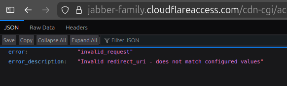

The redirect URL in the SaaS OIDC App doesn't match what Claude sends. Set it to exactly:
`https://claude.ai/api/mcp/auth_callback`

### "Invalid scope: claudeai"

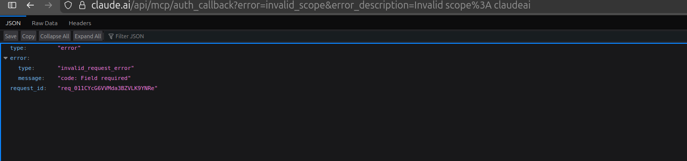

Remove non-standard scopes from your MCP Auth configuration. Only use `openid,profile`. Cloudflare's SaaS OIDC App rejects unknown scopes.

If your `/.well-known` JSON still lists `claudeai` in `scopes_supported`, update your MCP Auth settings and verify:

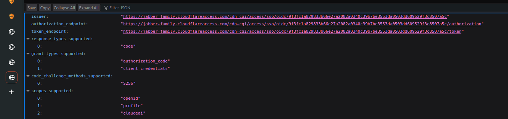
*This shows the incorrect state — the `claudeai` scope in `scopes_supported` causes Cloudflare to reject the request.*

### "openid scope is required"

Your `/.well-known/oauth-authorization-server` JSON must include `scopes_supported` with `openid` so Claude knows to request it.

### "code: Field required" at Claude's callback

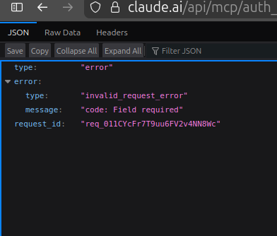

The OAuth flow completed authentication but failed to return an authorization code. This usually means the redirect URL or scope configuration is incorrect. Check both in the SaaS OIDC App settings.

### Claude connects but tools don't appear

- Verify the Linked App Token policy is assigned to the self-hosted app (check "Used by applications" column)
- Ensure the policy action is **Service Auth**, not Allow
- Check that your MCP server is running and accessible through the tunnel

> **Common mistake:** Adding the Linked App Token as a rule inside your existing Allow policy instead of creating a separate Service Auth policy. The screenshot below shows this incorrect configuration — notice all three rules (Login Method, Emails, and Linked App Token) are inside a single Allow policy:

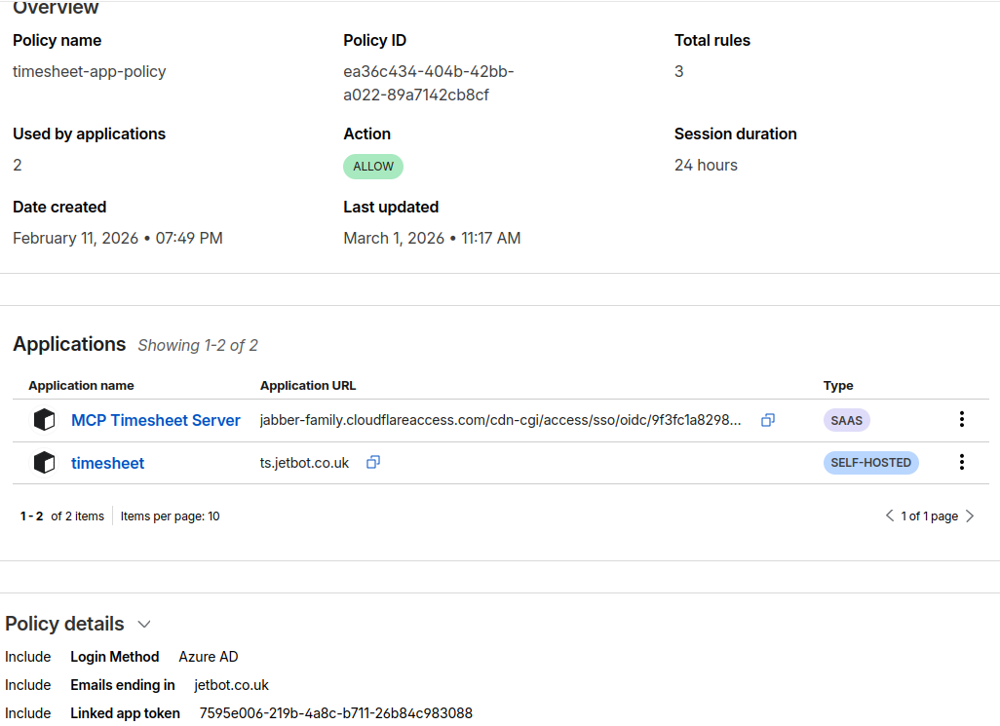
*⚠️ This is wrong — the Linked App Token rule should be in its own Service Auth policy, not mixed into the Allow policy.*

### Browser users can't log in anymore

The Bypass and Service Auth policies shouldn't affect browser access. Verify your Allow policy is still assigned to the self-hosted app and Azure AD is still configured as the login method.


### Token rejected (401/403) on MCP requests

- Confirm the Linked App Token policy references the correct SaaS OIDC App
- Verify the policy action is **Service Auth** (not Allow)
- Check the policy is assigned to the **main** self-hosted app, not the well-known app

---

## Key Concepts

### Why can't Claude use Cloudflare Access directly?

Cloudflare Access is designed for browser users. It intercepts requests, redirects to a login page, and sets a session cookie. Claude is an API client — it can't follow browser redirects or store cookies. It needs a standard OAuth 2.1 flow with token-based authentication.

### Why do we need a SaaS OIDC App?

Cloudflare Access only trusts tokens it issues itself. Even though Azure AD is the identity provider, Claude can't use an Azure AD token directly against Cloudflare Access. The SaaS OIDC App wraps Azure AD authentication in Cloudflare's own token format, which the Linked App Token policy can validate.

### Why a separate app for /.well-known?

Cloudflare Access doesn't support path-based rules within a single application's policies. The only way to bypass authentication for a specific path is to create a separate self-hosted application scoped to that path.

### Is exposing /.well-known a security risk?

No. OAuth discovery endpoints are public by design across all OAuth providers (Google, Microsoft, Cloudflare). The JSON contains only endpoint URLs and supported parameters — no credentials or tokens.
